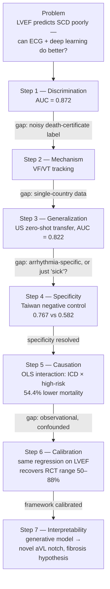

## Meeting with Professor Ziad Obermeyer (School of Public Health)

### Takeaways

* **Applied Mathematics?**  
  Cannot be the top in one field? Try to be in the top 5% in several fields!

* **In serious scenarios, like medical systems, how much do we value interpretability?**  
  Very much. Interpretability in this area means that we want our models to perform well on data they haven't seen before. Besides, we need to know if it really has a sense of "science". For example, if I edit the symptom a little, what kind of change will happen in the output, and is the change aligned with the biology?

* **Why do we still need mathematical models? "The bitter lesson" has said: the data and compute will definitely outperform engineered architecture.**  
  We need them. First, "Garbage in, garbage out". We need mathematical models to make some data more "high-quality". Secondly, sometimes we cannot directly investigate the things we want. Hence, we should use mathematical models to find proxies.

---

### An ECG biomarker for sudden cardiac death discovered with deep learning

**Ziad Obermeyer, Alexander Schubert, James Ross, Sendhil Mullainathan & Markus Lingman**  
*Nature* volume 655, pages 210–218 (2026)

**Abstract:**  
Sudden cardiac death is, in theory, preventable with defibrillators. But every year, many patients die without defibrillators because doctors fail to predict their risk. The only predictive biomarker in wide use, cardiac left ventricular ejection fraction (LVEF), misses most sudden cardiac deaths, and flags many low-risk patients for futile defibrillators that never fire. Here we apply deep learning to a dataset linking all electrocardiograms (ECGs) in a Swedish region to death certificates. The resulting model isolates a high-risk group (2.2% of the sample) with a 7.0% annual rate of sudden cardiac death, higher than those with reduced LVEF (1.9% of the sample; 4.6% annual rate). Notably, 86.1% of the model’s high-risk patients were not flagged by LVEF. High-risk ECG patients with defibrillators implanted were 54.4% less likely to die than expected, suggesting a mortality benefit. We externally validate the model in a US health system, in which it predicts ventricular arrhythmias that cause sudden death; and a Taiwanese hospital registry, in which it specifically predicts future arrhythmic cardiac arrests. To visualize the waveform morphology ‘discovered’ by the predictive model, we pair it with a generative model of the ECG waveform. Together, they reveal a biomarker that is easily visible and robustly predicts sudden cardiac death, but has not to our knowledge been previously described. Tying the biomarker’s shape to electrophysiological first principles, we form and preliminarily test a new hypothesis on the mechanism of sudden cardiac death.

---

## The Logical Structure of the Paper: A Chain of Falsification

This paper isn't "we ran an experiment and the model worked." It reads closer to a mathematical proof: state a bold claim, then actively search for the strongest counterexample, and design one targeted experiment to close each gap — repeat until every remaining gap is either closed or explicitly named. Unlike a proof, empirical work can never eliminate *all* alternatives; it can only make them implausible one by one. The result is a chain of eliminated alternative explanations. Below is that chain, compressed.

### Step 0 — The Problem

Sudden cardiac death (SCD) is fatal but in principle preventable: an implantable defibrillator (ICD) can shock a lethal arrhythmia back to a normal rhythm. The bottleneck is prediction. The only biomarker in clinical use, left ventricular ejection fraction (LVEF), fails in both directions — most SCD victims had normal LVEF (high false-negative rate), and most patients who get an ICD for low LVEF never fire it (high false-positive rate).

Claim to test: **a deep learning model reading raw ECG can out-predict LVEF.**

### Step 1 — Discrimination: does the score rank risk at all?

Metric: AUC, defined as

$$\text{AUC} = P\big(\text{score}(X_{\text{SCD}}) > \text{score}(X_{\text{no SCD}})\big)$$

the probability that a random SCD case is scored higher than a random patient who did not die of SCD (including people who died of other causes). AUC is chosen over accuracy because the base rate is only ~0.6%/year — a trivial "never predict SCD" classifier hits 99.4% accuracy while being useless. AUC does not depend on the base rate because it measures ranking, not hit rate.

The flip side: AUC says nothing about the *operating point*, which is what a clinician acts on. The decision-relevant comparison with LVEF is in the abstract: the model's top 2.2% have a 7.0% annual SCD rate versus 4.6% for the 1.9% flagged by low LVEF — a similar-sized group with a higher event rate — and 86.1% of the model's high-risk patients are people LVEF would never flag. That, more than the AUC, is the direct test of the Step 0 claim.

**Result:** AUC = 0.872, vs. 0.697 for the existing AHA/ACC risk score and 0.655 for a prior published ECG deep-learning model.

**Gap:** the training label is *cause of death on a death certificate* — a noisy, often guessed label. A model with high AUC here might just predict "cardiac-coded death" broadly, not the specific arrhythmic mechanism an ICD can actually treat.

### Step 2 — Mechanism: is it really tracking arrhythmia?

Fix: replace the death-certificate endpoint with **VF/VT** (ventricular fibrillation/tachycardia), the proximate mechanism an ICD interrupts — observable even in survivors, since not everyone with VF/VT dies.

**Result:** within the model's high-risk group, an additional 3.8%/year develop VF/VT (95% CI 2.2–7.0%), rising monotonically with risk score. (Censoring — a patient who dies before a VF/VT event can be logged — is corrected for explicitly.)

**Gap:** all data comes from one Swedish region, one healthcare system. Is the model exploiting local artifacts rather than a general physiological signal?

### Step 3 — Zero-shot transfer: does it survive a new country and device?

Fix: run the frozen model, with no fine-tuning, on an external US cohort — different ECG hardware, different sampling rate.

**Result:** AUC = 0.822 for VF/VT in the US, *higher* than Sweden's 0.717 — plausibly because US billing incentives capture VF/VT events more completely, and the US cohort spans a wider risk range.

**Gap:** this still only answers "can it rank risk," not "is the signal specific to arrhythmia." A model that merely learned "this patient is generally very sick" would also rank well here — and would be clinically useless, since an ICD cannot treat generic illness.

### Step 4 — Specificity: a negative-control outcome (Taiwan)

The sharpest test in the paper. If the model only detects general sickness, it should perform equally well on *any* severe illness. Test it on a population where cardiac-arrest cases are chart-reviewed and split into:

- arrhythmic arrest (n = 96) — the true target
- non-arrhythmic arrest (stroke, respiratory failure, etc.) — the negative control, playing the role of a placebo

**Result:** AUC = 0.767 for arrhythmic arrest vs. AUC = 0.582 (much weaker, though above chance) for non-arrhythmic arrest, P < 0.001. The model fails exactly where a mechanism-specific model should fail — which is what makes it credible.

### Step 5 — From ranking to causation: does the ICD actually help?

Everything above answers "can we identify high-risk patients," not "does treating them work." That's a causal question, and there is no RCT here — only observational data, modeled with an OLS interaction term:

$$\text{death} = \beta_0 + \beta_1(\text{high risk}) + \beta_2(\text{has ICD}) + \beta_3(\text{high risk} \times \text{has ICD}) + \text{controls}$$

$\beta_3$ is the quantity of interest: do patients who are both high-risk and have an ICD show *less* mortality than the two main effects alone would predict?

**Result:** $\beta_3$ implies 54.4% lower-than-expected mortality (P < 0.001).

**Gap, stated plainly by the authors:** ICD assignment isn't randomized. Physicians choose who gets one, and that choice correlates with unmeasured confounders (more attentive overall care, closer follow-up, etc.). $\beta_3$ conflates true causal effect with selection bias — the two cannot be cleanly separated from observational data alone.

### Step 6 — Calibrating the framework against a known answer

Since the confounding in Step 5 can't be removed, the authors instead check whether the *method itself* is trustworthy: run the identical regression on LVEF, a risk marker whose ICD benefit has already been established by multiple RCTs (effect size 50–88% mortality reduction).

**Result:** the same regression recovers 67.5% — squarely inside the RCT-validated range.

This doesn't prove Step 5's causal estimate is unconfounded; it is evidence that the regression framework isn't systematically broken. A badly miscalibrated framework would be unlikely to reproduce a known RCT effect size by chance. This is calibration, not confounder removal — a distinction the authors are careful to state.

### Step 7 — Opening the black box

A high-AUC model is still a black box unless it can say *what* it sees. The authors pair the predictor with a generative model (VAE) of the ECG waveform, then take a real low-risk waveform and push it, gradient by gradient, toward higher predicted risk — producing a sequence of synthetic, increasingly "high-risk" heartbeats a cardiologist can read directly.

Findings:

1. **Left axis deviation** — an already-known ECG marker (associated with left anterior fascicular block). Its emergence validates the method: the morphing procedure recovers something medically real, not noise.
2. **A previously undescribed notch at the end of the QRS complex in lead aVL** — quantified via first/second derivatives of QRS amplitude, shown to be an independent, significant predictor with strength comparable to left axis deviation. The authors hypothesize this reflects myocardial fibrosis (collagen deposits disrupting electrical conduction), with preliminary cMRI support — explicitly framed as hypothesis-generating, since definitive diagnosis would require endomyocardial biopsy, rarely performed clinically.

### The chain, compressed

### Where the chain is still weak

Reading the chain as adversarially as the authors read their own claims, a few links deserve a second look.

1. **The AUC drop is itself a finding.** Discrimination falls from 0.872 (SCD on death certificates) to 0.717 (VF/VT in Sweden) once the endpoint becomes the mechanism an ICD can treat. Part of the headline AUC is therefore likely predicting "cardiac-coded death" in general — exactly the Step 1 gap. The mechanistic number, not the headline one, is the honest estimate of what the model knows about arrhythmia.

2. **A negative control is only as sharp as its outcome is predictable.** A low AUC for non-arrhythmic arrest shows specificity only if a generic "how sick is this patient" score *does* predict non-arrhythmic arrest well. If those arrests are hard to predict from anything, a weak AUC there is uninformative. The cleanest version pairs the ECG model with a sickness baseline (age, comorbidities) on both outcomes and shows the two models swap places.

3. **The interaction term is a difference-in-differences.** Comparing ICD and non-ICD patients directly mixes the device's effect with "ICD patients get better care". The $\beta_2$ term absorbs that care effect *as long as it is the same in both risk groups*, and $\beta_3$ reads only the extra benefit in the high-risk group. So the remaining threat is narrower than "confounding" in general: it is selection that *differs by risk group* — for example, if physicians implant ICDs in high-ECG-risk patients who are otherwise unusually healthy.

4. **Who actually received an ICD?** In routine care, ICDs are implanted mainly for low LVEF. But 86.1% of the model's high-risk patients have normal LVEF, so the high-risk ICD recipients behind $\beta_3$ are probably drawn largely from the LVEF-flagged minority. The 54.4% estimate may then say least about the very patients the model would newly send for an ICD. That question — does an ECG-guided ICD help people with normal LVEF? — needs a randomized trial.

5. **The positive control transfers only partly.** For LVEF, ICD allocation follows guidelines built on LVEF itself; for the ECG score, allocation is unrelated to the score, which physicians never saw. The selection bias in the two regressions can therefore differ, and with an RCT range as wide as 50–88%, landing inside it is a reassuring sign, not a strong test.

6. **High risk is still mostly no event.** A 7.0% annual rate means roughly 93 of every 100 flagged patients will not have SCD that year, while ICDs carry real costs (inappropriate shocks, infection, lead failure). The fair benchmark is the one the paper uses — current practice already accepts LVEF's 4.6% — but the decision ultimately turns on multi-year benefit against harm, which no AUC captures.

None of this undercuts the paper's structure; it is the same method applied one level further. Each point names the next experiment, which is what a good chain of falsification is supposed to do.

### Why this structure is worth studying

The mathematical habit on display is close to proof by contradiction paired with adversarial peer review: after every claim, ask "what is the strongest way this could still be wrong?", then design the one experiment that would falsify it. A less careful paper stops at Step 1 (AUC = 0.872) and calls it done. But a single high AUC proves almost nothing clinically — it can hide label noise, geographic overfitting, mechanism confounding, and selection bias, all at once. What makes this paper credible isn't model strength; it's that every one of those failure modes was hunted down, one at a time — closed where it could be, and stated plainly where the fix still falls short.
