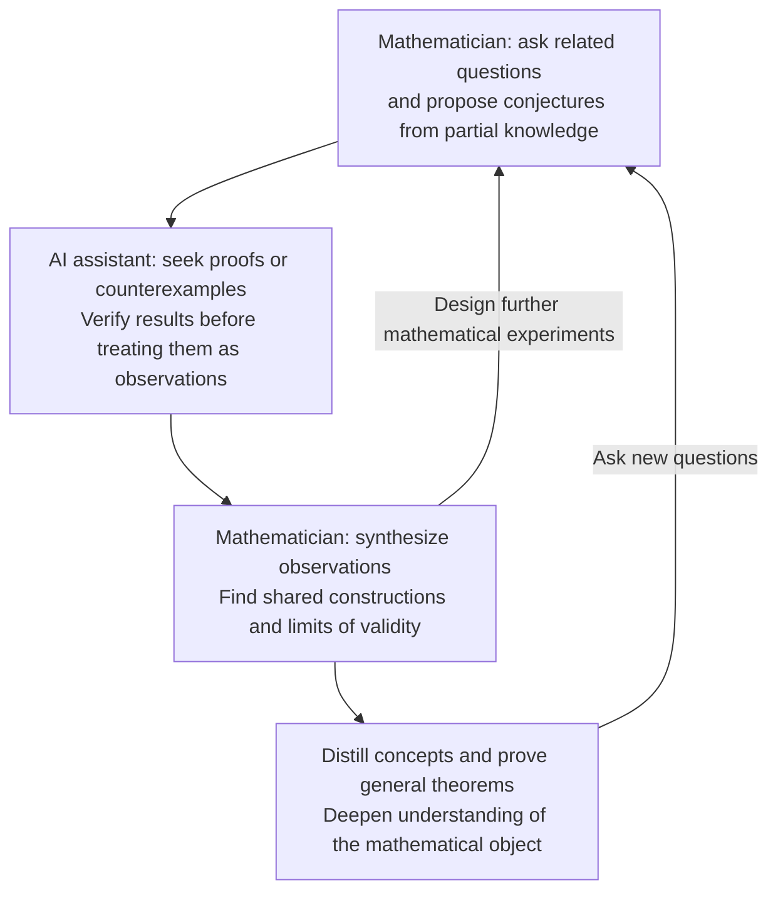

## What happens after an AI produces a proof?

Much of the discussion concerns whether the proof is correct, elegant, or genuinely useful. I have been wondering about a further possibility:

**Mathematics could remain deductive in justification while becoming more empirical in how we discover structures and form theories.**

Discussions about AI proofs often turn to elegance and understanding. A machine might produce a correct argument that is long, awkward, or difficult to learn from. That seems like a limitation. But perhaps such a proof could also be a beginning.

### Proofs as observations

In the past, we could only observe small examples or special cases that humans can handle by hand. With AI, observation can be extended to a far larger scale. The intermediate objects, reductions, and constructions of complex counterexamples become material to study. They are the phenomena of mathematical principles, and observations that can scale up.

Like observations that helped physicists develop thermodynamics, verified proofs and counterexamples can guide mathematicians toward underlying structures. Summarizing these observations and testing further conjectures creates a cycle of discovery; advances in AI can make this cycle easier to repeat at scale.

> Terence Tao's [brief tour of the Equational Theories Project](https://terrytao.wordpress.com/2024/10/12/the-equational-theories-project-a-brief-tour/) gives a concrete example of exploring a large family of mathematical questions with machine assistance.

### Verification and understanding are different achievements

Verification settles truth, but understanding still lives in the mind rather than the compiler. Mathematicians have long turned opaque arguments into understanding by reworking them, and a collection of machine-generated proofs could sometimes invite the same process. An awkward proof may contain a useful idea that has not yet been expressed clearly.

### Some concerns

- **What about failures?** Failures are ambiguous. Failing to find a proof or counterexample may reflect the model's limitations or the nature of the conjecture itself. We need to distinguish the two.
- **Will lock-in take place and we stop delving into foundations?** I believe mathematicians can notice repeated friction in AI's output. That is where we should revisit our foundations.